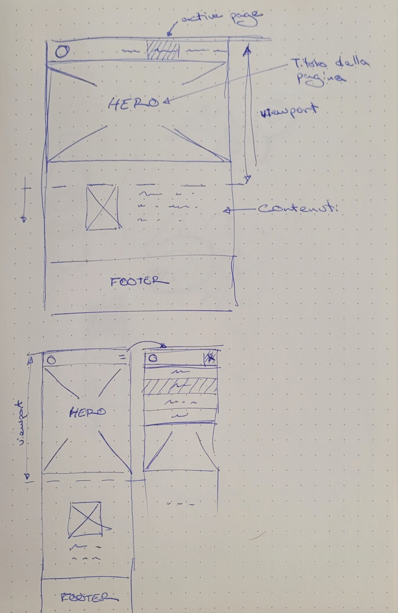
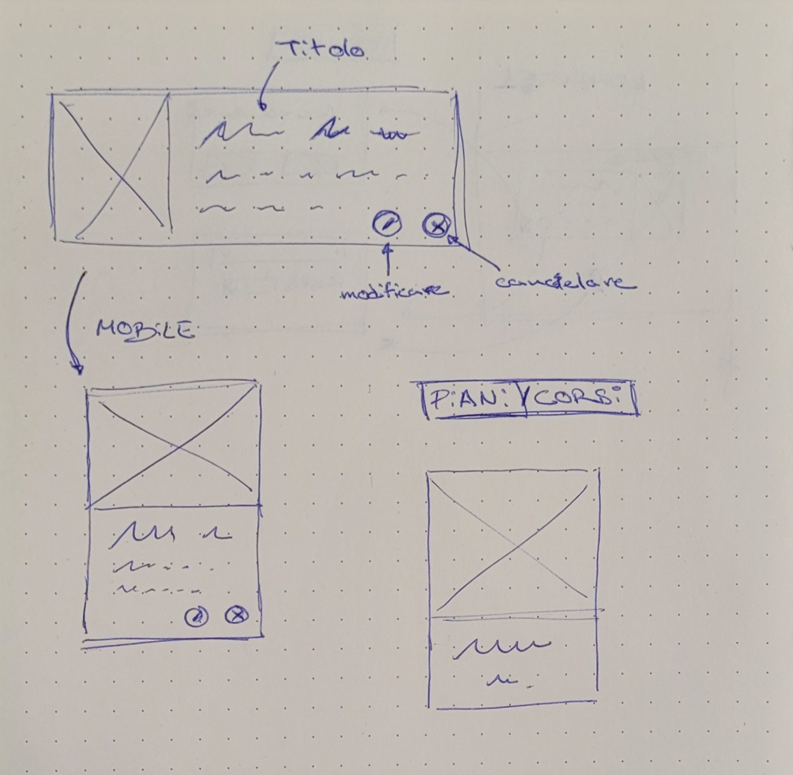
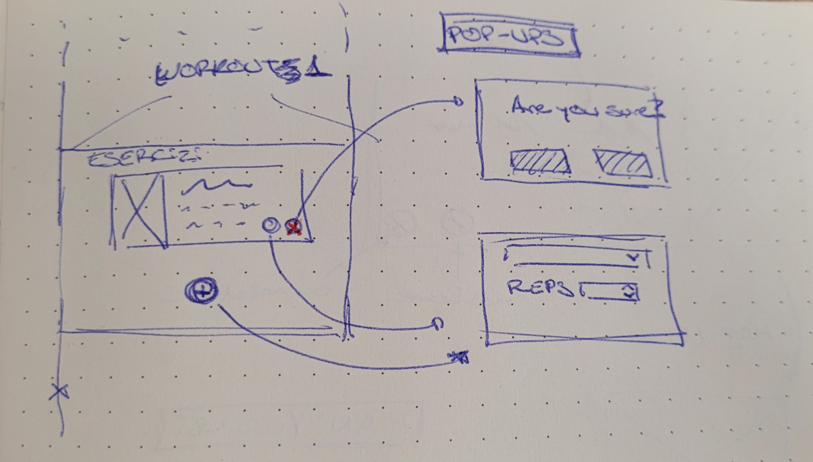

# Progettazione concettuale

La idea è realizzare una applicazione web di una palestra.  Ho pensato di fare
le pagine in inglese, per che non domino il italiano al stesso livello.

## Pagine generiche

Ogni pagina avrà un `header`, con il logo, a la sinistra e un menu di
navigazione a la destra. Anche, avrà un `footer` con informazioni importanti,
come il indirizzo, un `form` per contattare con noi.  Anche, ho pensato di
aggiungere un "hero".

{ height=66% }

## Struttura

Le pagine a includere saranno le prossime:

- homepage / landing
- services
    - courses
    - plans
- about us
- member area
    - explore workouts
    - workout

In diversi pagine i contenuti saranno organizzati tramite *cards*, con una
immagine rappresentativa (workouts; 1 card per workout, workout; 1 card per
essercizo, courses, plans and about us; i membri degli staff).

{ width=50% }

Anche, in due pagine (workouts, workout plans) ho pensato di aggiungere
funzionalità per editare i diversi piani, cancellare i piani o aggiungere
esercizi a un piano, ma questo può essere molto per sviluppare e può essere che
solo sarà possibile fare questo sul lato dal database.  In nessun caso sarà
consentito agli utenti di aggiungere esercizi.

{ width=75% }

## Database

Il database sarà implementato tramite postgres, per che sono facendo un altro
corso di sistemi di basi di dati nel che dovo sviluppare un progetto con questa
tecnologia.

## Paletta di colori

Ho pensato di utilizzare una paletta di colori arancione, e utilizzare il
[material theme builder](https://material-foundation.github.io/material-theme-builder/),
caricare una immagine arancione.

## Note

Ho pensato di chiamare la palestra 'XEPS', e tutti i immagini (logo,
placeholder, ...) saranno disegnati a mano per non avere bisogno di cercare in
internet.

## Nota

Il login sarà un semplice login, implementato tramite cookies, e i passwords
saranno salvate in testo piano sul lato dal database.  Se che questo può essere
un problema sul lato de la sicurezza, ma non voglio implementare una webpage
tropo complessa.
